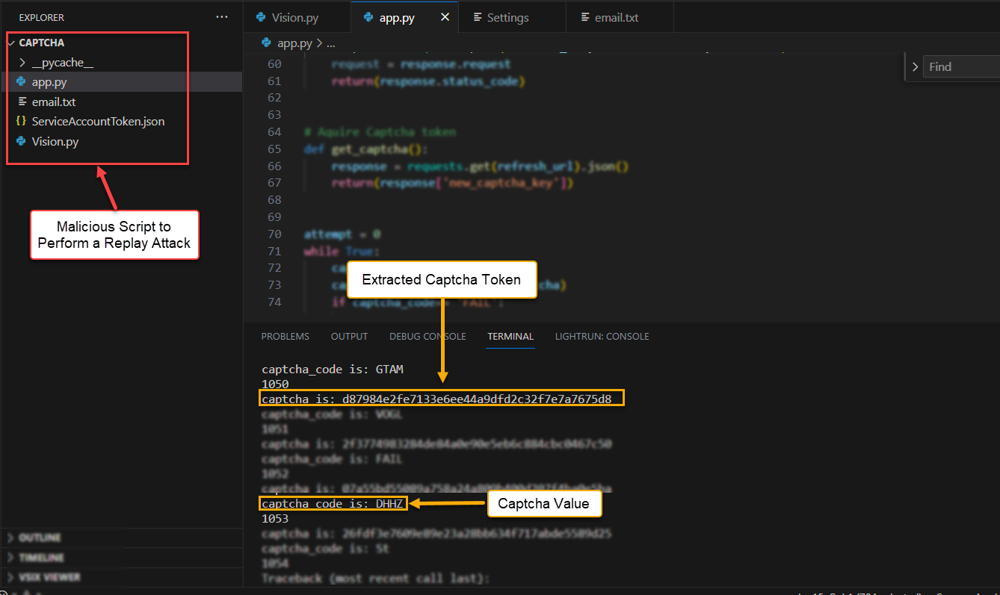

# Automated Captcha Bypass using Google VisionAI OCR

Welcome to the OCR Bypass project, where we explore an intriguing experiment involving the Google VisionAI API to navigate past website captchas. Please note that this project is intended for educational purposes.

## Prerequisites

Before diving into this script, ensure you have the following set up:
- Google Cloud SDK
- Python 3.7 or higher
- Google Cloud Vision API
- Obtain a `ServiceAccountToken.json` from Google Cloud

## Getting Started

```python
victim_email = "{{victim@victim.com}}"  # Replace with the target victim's email address
base_url = "{{Base_URL}}"  # Modify with the URL of the password reset page
captcha_refresh_url = '{{Captcha_Refresh_Page}}'  # Adjust to the URL of the captcha refresh page

headers = {
    'Host': '{{Host}}',  # Set to the host of the password reset page
    # Include any other necessary headers for the password reset request
    'Connection': 'close'
}

##Usage Example:
Step 1: Understand the Captcha Mechanism.


##Step 2: Configure the Script and Initiate the Attack




##Step 3: Witness Automated Captcha Bypass in Action


##Contributing
A big shoutout to Tal Argoni for providing the opportunity to contribute to this project.

##License
Copyright © 2023 David Smolovich.
This code is made available under the terms of the license. Please use it exclusively for educational purposes. We encourage learning and responsible use of technology,

